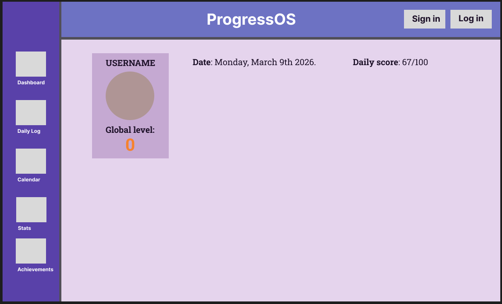

# ProgressOS

ProgressOS je Web aplikacija koja omogućuje korisnicima praćenje vlastitog napretka u različitim područjima života kroz kombinaciju statističkog praćenja aktivnosti i gamify sustava. Aplikacija je zamišljena kao alat koji korisnicima pomaže razviti konzistentne navike i pratiti vlastiti long-term razvoj kroz jasno prikazane podatke, statistiku i reward system.

Glavna ideja aplikacije je pretvoriti svakodnevne aktivnosti u mjerljiv napredak. Korisnik kroz jednostavan sustav dnevnog unosa aktivnosti (Daily Log) bilježi aktivnosti poput programiranja, vježbanja, sporta, spavanja ili meditacije. Na temelju tih aktivnosti aplikacija automatski izračunava različite statistike, experience points, povećava level i prati long-term rezultate korisnika.

Za razliku od jednostavnih habit tracking aplikacija, ProgressOS kombinira *etaljno praćenje aktivnosti (tracker) i gamifikacijski sustav napredovanja (gamified system). Svaka aktivnost doprinosi određenoj kategoriji života, poput health, productivity ili sport, te kroz vrijeme povećava ukupni napredak korisnika.

Sustav aplikacije organiziran je kroz hijerarhiju kategorija (branches). Postoji nekoliko glavnih kategorija koje predstavljaju ključna područja života, kao što su health, productivity, sport, coding i social life. Unutar tih kategorija korisnik može dodavati vlastite podkategorije ili aktivnosti. Na primjer, unutar kategorije Sport korisnik može dodati aktivnosti poput odbojke ili košarke, dok u kategoriji Produktivnost može pratiti vrijeme provedeno programirajući ili učeći.

Svaka aktivnost koju korisnik unese u dnevni zapis automatski se obrađuje u pozadini aplikacije. Sustav iz tih podataka računa dnevne statistike, ukupne statistike kroz vrijeme (All-Time stats), levele kategorija i globalni level korisnika. Razina se računa na temelju ukupnog broja experience bodova koji se dobivaju kroz aktivnosti. Sustav koristi eksponencijalni model rasta razina, što znači da je za svaku sljedeću razinu potrebno sve više iskustva, čime se potiče long-term konzistentnost.

Poseban element aplikacije je Daily Score sustav, koji svakom danu dodjeljuje ocjenu od 0 do 100 na temelju različitih aktivnosti poput spavanja, produktivnosti, fizičke aktivnosti i raspoloženja. Ovaj sustav omogućuje korisniku da brzo procijeni kvalitetu pojedinog dana.

Aplikacija također uključuje kalendarski prikaz aktivnosti inspiriran GitHub contribution grafom. Svaki dan u kalendaru prikazuje ikone aktivnosti koje su se dogodile tog dana, poput programiranja, sporta ili vježbanja. Na taj način korisnik može vrlo brzo dobiti vizualni pregled svoje konzistentnosti kroz vrijeme.

Uz to, ProgressOS uključuje sustav postignuća (Achievements) koji nagrađuje korisnike za različite prekretnice poput prvog treninga, određenog broja sati programiranja ili dugih nizova konzistentnosti (streaks). Sustav streakova prati koliko dana zaredom korisnik obavlja određene aktivnosti.

Sve prikupljene informacije prikazuju se kroz interaktivne grafove i statistiku. Korisnik može vidjeti dnevne rezultate, prosjeke kroz vrijeme i ukupne statistike poput ukupnog broja sati programiranja, ukupnog broja treninga ili ukupnog broja ponavljanja pojedinih vježbi.

Cilj projekta je izraditi funkcionalnu web aplikaciju koja omogućuje korisnicima long-term praćenje osobnog napretka kroz kombinaciju statistike, vizualizacije podataka i gamifikacije.

---

# Tablica funkcionalnosti

## Osnovne funkcionalnosti

| Funkcionalnost         | Opis                                                              |
| ---------------------- | ----------------------------------------------------------------- |
| Registracija i prijava | Korisnici mogu kreirati račun i prijaviti se u aplikaciju         |
| Korisnički profil      | Pregled i uređivanje podataka korisnika                           |
| Daily Log              | Dodavanje dnevnih aktivnosti                                      |
| Activity sustav        | Unos različitih tipova aktivnosti (vrijeme, broj, workout, sport) |
| Calendar view          | Kalendarski prikaz aktivnosti s ikonama                           |
| All-Time statistika    | Praćenje ukupnih statistika kroz vrijeme                          |
| Branch sustav          | Organizacija aktivnosti u kategorije života                       |
| EXP i Level sustav     | Napredovanje kroz experience points                               |
| Daily Score            | Dnevna ocjena produktivnosti                                      |
| Streak sustav          | Praćenje konzistentnosti aktivnosti                               |

---

## Napredne funkcionalnosti

| Funkcionalnost     | Opis                                               |
| ------------------ | -------------------------------------------------- |
| Achievement sustav | Otključavanje postignuća                           |
| Grafovi statistike | Vizualni prikaz aktivnosti kroz vrijeme            |
| Workout tracking   | Praćenje vježbi, setova i ponavljanja              |
| Exercise library   | Lista osnovnih vježbi s mogućnošću dodavanja novih |
| Sport tracking     | Praćenje sportskih aktivnosti                      |
| Custom aktivnosti  | Korisnici mogu dodavati vlastite aktivnosti        |
| Notes sustav       | Bilješke za aktivnosti ili cijeli dan              |
| Global Level       | Ukupna razina korisnika kroz sve kategorije        |
| Dashboard          | Centralni pregled svih statistika                  |

---

# User Flow

### 1. Registracija

Korisnik dolazi na aplikaciju i kreira novi račun putem registracije. Nakon registracije može se prijaviti i pristupiti glavnom dashboardu aplikacije.

---

### 2. Dashboard

Nakon prijave korisnik vidi dashboard koji prikazuje:

* globalni level
* napredak kroz EXP
* današnje aktivnosti
* trenutne streakove
* kalendar aktivnosti
* grafove

---

### 3. Dodavanje aktivnosti

Korisnik otvara opciju Add Activity i odabire aktivnost iz liste.

Primjeri aktivnosti:

* Coding – 2h
* Workout
* Pushups – 50
* Volleyball training – 2h
* Meditation – 10min

Aktivnosti se automatski spremaju u dnevni log.

---

### 4. Automatsko računanje statistike

Nakon dodavanja aktivnosti aplikacija automatski:

* ažurira dnevne statistike
* dodjeljuje EXP
* povećava level kategorija
* računa daily score
* ažurira streakove

---

### 5. Pregled statistike

Korisnik može otvoriti statistiku i vidjeti:

* grafove aktivnosti
* ukupne statistike
* napredak kroz vrijeme
* otključana postignuća

---

### 6. Dugoročno praćenje napretka

Kroz duže korištenje aplikacije korisnik može pratiti:

* ukupne sate programiranja
* ukupne treninge
* broj ponavljanja vježbi
* sportske aktivnosti
* kvalitetu sna

---

# Vizualni prototip

## Glavne stranice aplikacije

### Dashboard

Prikazuje:

* Life Level
* XP progress bar
* Daily Score
* Current Streaks
* Calendar
* Graphs
* Achievements preview

---

### Daily Log

Stranica za dodavanje aktivnosti:

* Add Activity
* Lista aktivnosti tog dana

---

### Statistics

Prikaz:

* grafova
* all-time statistika

---

### Activities / Branches

Pregled svih kategorija i podkategorija aktivnosti.

---

### Achievements

Stranica s otključanim postignućima.

---

### Profile / Settings

* korisnički profil
* uređivanje podataka
* logout
* password reset

 
